### Hi there 👋

I am a french student who loves computers :heart:

---

#### ℹ️  Informations :

- 👨‍💻 Contributor of [Luanti](https://github.com/minetest/minetest) (fka. Minetest) and the [VoxeLibre](https://git.minetest.land/MineClone2/MineClone2)  (fka. MineClone2) game
- 📁 Web, Desktop & Game Development 
- 📗 Currently learning C++ and Rust

---

**🗨️ Want to talk? Reach me on Discord!** **_`@afcms`_**

---

#### 🛠  Languages and Tools :

&nbsp;
&nbsp;
&nbsp;
&nbsp;
&nbsp;
&nbsp;
&nbsp;
&nbsp;
&nbsp;
&nbsp;
&nbsp;
&nbsp;
&nbsp;
&nbsp;
  &nbsp;

---

#### 🕐 &nbsp;Stats :

<!--  -->
